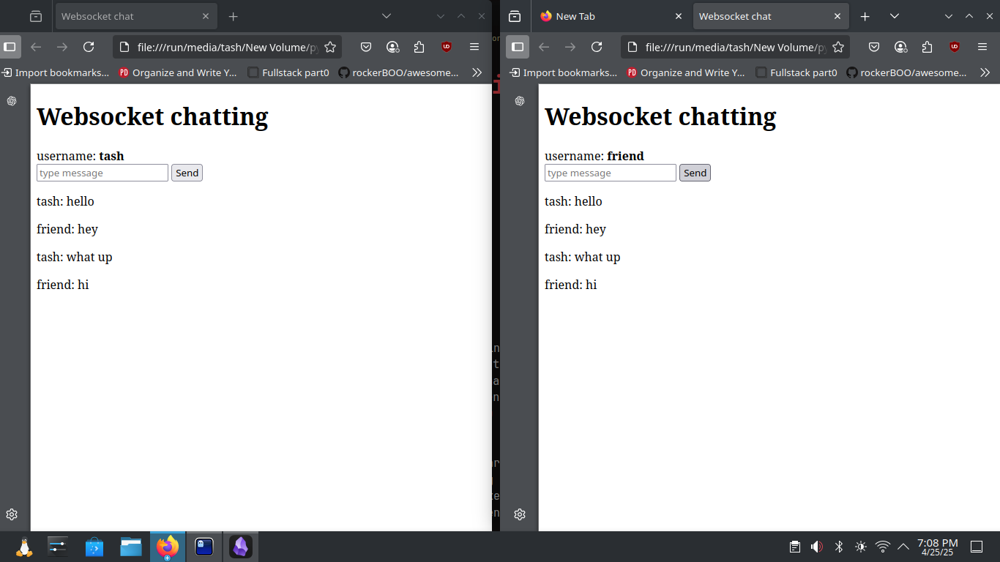

# websocket-fastapi-chatapp

A real-time chat application built with FastAPI and WebSockets. This app allows users to join different chat rooms, send and receive messages in real-time, and enjoy an interactive messaging experience. The backend is powered by FastAPI, and WebSockets are used to handle real-time communication between the server and clients.


## Technologies Used

- **Backend**: FastAPI, WebSockets
- **Frontend**: HTML, CSS, JavaScript 

## Requirements

- Python 3.8+
- FastAPI
- Uvicorn
- WebSockets

## Installation

1. **Clone the repository**:

   ```bash
   git clone https://github.com/TASh7899/websocket-chat-app.git
   cd websocket-chat-app
   ```

2. **Create a virtual environment**:

   ```bash
   python3 -m venv venv
   source venv/bin/activate  # On Windows, use `venv\Scripts\activate`
   ```

3. **Install dependencies**:

   ```bash
   pip install fastapi
   pip install uvicorn
   pip install websockets   
   ```

4. **Run the FastAPI app**:

   ```bash
   uvicorn main:app --reload
   ```

## Usage

- run the main.py file using `unvicorn main:app --reload`
- Open your browser and load your html file.
- You should be able see prompt to type your name

## screenshot


## Contributing

Contributions are welcome! If you'd like to improve the app, please fork the repository, create a feature branch, and submit a pull request.

